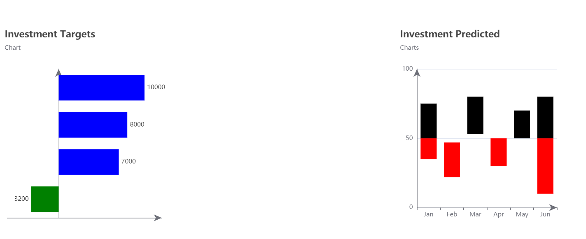

# Vue & Echarts.js

## Project setup
```
npm install
```

### Compiles and hot-reloads for development
```
npm run serve
```

### Compiles and minifies for production
```
npm run build
```

### Lints and fixes files
```
npm run lint
```
*** 


## Charts chosen from the echarts examples:
1. https://echarts.apache.org/examples/en/editor.html?c=bar-negative2
2. https://echarts.apache.org/examples/en/editor.html?c=bar-waterfall


## How to integrate Echarts with Vue
https://programmer.ink/think/how-to-use-echarts-in-vue-projects.html


## Vue hooks
- every time the props change, this we'll be computed, reevaluated
- when a component is fully rendered we call the hook "mounted". this will only happen once
- if there is any change , than "watch" listens (hook)

***


## Storybook
https://storybook.js.org/docs/react/get-started/install
https://kreuzwerker.de/en/post/storybook-for-vue

Run it: 
```
npm run storybook
```


## Final result

  

## Storybook

